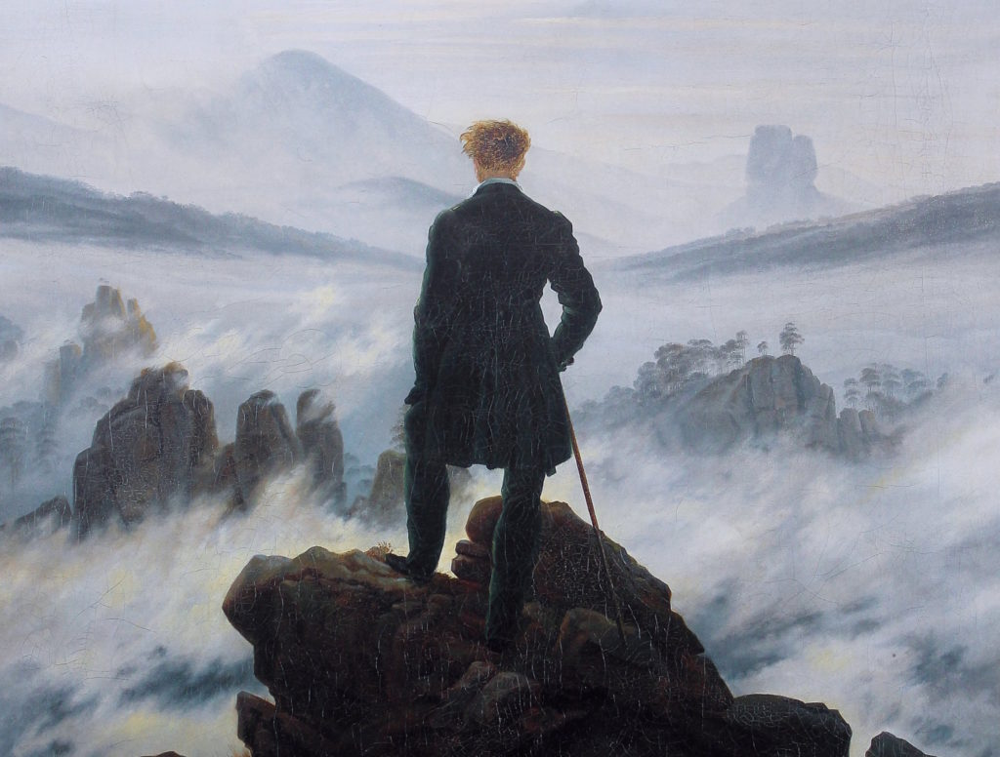

# The "Why" of Intelligence and Agency as ACEL's Focus

<figure><figcaption>
<em>Wanderer above the Sea of Fog</em> - Caspar David Friedrich (1818)
</figcaption></figure>

## The Mutualism Between _Intelligence_ & _Agency_: An Overview

This palpable, intensity-dense force — this thrumming potency that stands humans plumb upright and steady-eyed to their catalytic role in the play toward new paradigms — is born not just of a general self-awareness, but of an [awareness _aware_ ](#user-content-fn-1)[^1]of the mechanics of its own intelligence, of its own agency, and of the complementary dynamism shared between these two textures of human consciousness. Ringing true here is Jean-Paul Sartre's quip, "I must necessarily possess a certain comprehension of freedom," where, as is shown below, freedom is but _the_ condition of agency (439). But it is not only the _comprehension_ of the layers composing our consciousness that is within the human's grasp; attendant with this self-appraisal comes the wielding of a directed focus, one able to hone in, even manipulate, even _accelerate_ the acquisition of knowledge and the building of agency.&#x20;

This is an awareness that for now is still unique to human beings; and it is just this that places upon the species' shoulders the opportunity — and the responsibility — to secure the continued survival of biological machines. For, as the premise of ACEL's entire raison d'être — that of securing for humanity a more favorable, i.e. lasting, half-life — is optimally, perhaps _only_ carried out through just this direct engagement with intelligence and agency. For this reason, it is imperative that this book delineate the reasons for and methods by which one might optimize navigating the direct, reflexive, causative relationality between them.&#x20;

In so doing, the human _self_ — specifically, the gears that turn its consciousness towards, and _through_ the extension of its own species – will, of itself, become singularly oriented toward output maximization; both its intelligence and agency most efficiently deployed, all potentials manifest toward extending the survival of the species. How this is accomplished requires further examination into the play between intelligence and agency.&#x20;

Framing

* Jean-Paul Sartre (1943): Sartre’s concept of freedom as both a condition for and an expression of action (agency) is used to frame the relationship between intelligence and agency. The text emphasizes that this freedom is essential for the exercise of agency, a point that aligns with Sartre's existentialist philosophy presented in Being and Nothingness. Sartre’s work is relevant because it directly connects the concepts of freedom and agency, making it a strong philosophical foundation for discussing the mutual reinforcement of intelligence and agency. His existential framework helps to justify the importance of these concepts in the development of human consciousness.
* Georg Wilhelm Friedrich Hegel (1807): Hegel’s idea that thought (intelligence) is the source of human freedom is introduced as a foundational concept. The chapter leverages this to argue that intelligence and agency are mutually reinforcing, where intelligence enables the freedom necessary for agency, which in turn drives further intelligence. Hegel’s ideas are central because they provide a historical and philosophical backdrop that underscores the chapter's exploration of intelligence as the root of human agency. His framework supports the argument that these two aspects of consciousness have driven human progress.

References:

1. Sartre, Jean-Paul. Being and Nothingness: An Essay on Phenomenological Ontology. 1943.
2. Hegel, Georg Wilhelm Friedrich. The Phenomenology of Spirit. 1807

Tensions

Tensions:

* The section may imply a linear and overly deterministic relationship between intelligence and agency, which could be seen as a simplification of Sartre’s and Hegel’s more complex ideas.

Inaccuracies/Misinterpretations:

* The interpretation of Sartre’s notion of freedom as solely a condition for agency might overlook his broader existential concerns, such as the role of bad faith and the complexities of human choice.

Solution:

* To address these potential oversights, the text could incorporate a discussion of the limitations and challenges inherent in exercising agency, as highlighted by Sartre, to provide a more nuanced view of the relationship between intelligence and agenc

## The Compounding Nature of Coordination&#x20;

The formula is simple, as it is directly causative: an increase in intelligence begets an increase in agency; an increase in agency begets an increase in intelligence. Not only do these two textures of consciousness operate harmoniously, they exist in a consistent feedback loop, a reflexively compounding echo chamber of power. This becomes clear when examining the emergent growth of humanity: the RNA replication of itself; the protists' first acts of sexual reproduction; the first standing upright; the first vocalizations grunted — all of these, whether conscious or not, were bold acts of agency that flung wide open the doors to larger intelligence repositories. In turn, these deepened reservoirs of knowledge walked humanity, or a primitive iteration of it, up to yet another explosion of agency. And so on and so forth.&#x20;

Interestingly, when plotting this evolutionary in-step, when tracking their historical foot-stepped data points – variables _quantity over aggregated time_ – the strides of intelligence and agency present a geographical line. That is to say, when zoomed out, there is betrayed out of their concordant play a _fluent, singular directionality_: their power-compounding cadence sometimes ambled, sometimes marched through a 4-billion-year quanta of continuities. Theirs is a long stroll — erratic in the short-term, stabile-in-the-long — defined overall by an aggregated growth of one another, whom together are ever-converging with some later _now_. Thus, it is seen with long aerial view that, over the many once-present millennia, these two pals, from their first step, have only walked in this very direction — to arrive just here with never as so-deep, so-wide, and so-filled oceans of themselves.

Framing

* Gilles Deleuze (1987): Deleuze’s concept of the "rhizome" and non-linear progression is relevant to the discussion of how intelligence and agency interact in a feedback loop. The chapter suggests that the compounding nature of these two forces is not strictly linear but can be seen as a complex, interconnected system, much like Deleuze’s rhizomatic structures.
  * &#x20;Deleuze’s ideas are pertinent because they challenge the notion of linear historical progression, offering a more dynamic model that better captures the complexities of intelligence and agency interacting in a feedback loop. His philosophy enriches the chapter's argument by providing a framework for understanding the non-linear, multifaceted growth of these concepts.
* Jean Hyppolite (1946):  Hyppolite’s interpretation of Hegel's dialectical process supports the idea that intelligence and agency evolve together in a continuous, self-reinforcing manner. His work helps to frame the discussion of the historical progression of these concepts in a Hegelian context.
  * Hyppolite’s work is included to help ground the chapter’s discussion of the historical development of intelligence and agency in a well-established philosophical tradition. His interpretation of Hegelian dialectics supports the idea of a continuous, self-reinforcing process that drives human evolution.

References:

1. Deleuze, Gilles, and Félix Guattari. A Thousand Plateaus: Capitalism and Schizophrenia. 1987.
2. Hyppolite, Jean. Genesis and Structure of Hegel's Phenomenology of Spirit. 1946.

Tensions

Tensions:

* The section may struggle to reconcile Deleuze’s non-linear, decentralized model with the more structured, dialectical progression favored by Hegel and Hyppolite.

Inaccuracies/Misinterpretations:

* There is a potential risk of oversimplifying Deleuze’s rhizomatic model to fit into a more traditionally structured historical narrative, which could misrepresent his philosophy’s emphasis on decentralization and multiplicity.

Solution:

* To address this, the chapter could emphasize the complementary nature of Deleuze’s and Hegel’s frameworks, highlighting how the former’s model of multiplicity and the latter’s dialectical process can coexist in understanding the evolution of intelligence and agency.

## This Relationship's Theoretical Precedent&#x20;

Of course, upon this sustained, directional, asymptotic orientation of these two in-cahoots structures of consciousness, particularly their one-by-another brimming-over potential, our curious, perhaps suspicious-for-obviousness, even capitalist-appraising gaze, our locked and literal _self_-enchantment can not claim here what it observes to be original, for this idea is hardly novel: Hegel had been fully aware of this causative interplay between intelligence and agency when writing his 1807 magnum opus, _The Phenomenology of Spirit._ On this, Houlgate sums up cleanly Hegel's position on the matter when he states, "The main source and element of human freedom, for Hegel, is thought" (Houlgate 26). It is easy enough to understand "thought" here as _intelligence_; but what does Hegel mean by _human freedom,_ if not the state of being in total possession of one's own _capacity to act_, _to think_; the being sole proprietor — the _agent_ — of one's own existential property?&#x20;

To corroborate initial readings of Hegel's meaning, we might consider Jean-Paul Sartre's notion of _freedom_ in _On Being and Nothingness: An Essay on Phenomenological Ontology_. Within, Sartre says of _freedom_ — specifically, of the relationship between freedom and "the act_",_ i.e. agency, "the act is the expression of freedom... the fundamental condition of the act is freedom" (Sartre 438). For Sartre, then, _freedom_ is conditional _to_ and expressed _by_ and _through_ action. In short, there is no agency without freedom, because agency _is_ freedom: the _freedom to act_.&#x20;

This evinces a formulaic causative connection between these concepts for Sartre and Hegel: For Sartre, the fundamental condition of action (i.e. agency) is _freedom_; Hegel claims that the source of this freedom is _thought_ (i.e. intelligence). Taken together, Sartre and Hegel reveal that _thought is the source for the condition of action_. Said another way: _intelligence is the source of the condition of agency_.&#x20;

But there is more to this relationship than just unidirectional causality: In fact, when analyzing Hegel (à la Houlgate) through the lens of Sartre's notion of _freedom_, it becomes apparent that Hegel, too, implicitly suggests there exists an intercausative relationship between intelligence and agency. Per Houlgate's quote above, Hegel understood thought/intelligence to be _dual-natured_ in its relationship to freedom/agency: as both the latter's primary "source" _and_ its primary "element". It has already been shown above how thought/intelligence is _source_ _to_ and _causative of_ freedom/agency (i.e. freedom-_by-_thought). It is this second piece — that of thought/intelligence as _elemental_ to freedom/agency — that betrays a simultaneous and inverse causation for Hegel. Using the syllogistic formula, if, for Sartre, "the act is the expression of freedom;" and the main element of freedom for  Hegel is _thought_; then it can be stated that, "the act is the expression of the primary element of thought." To say this another way, agency expresses, or manifests, or evokes — _causes —_ intelligence.&#x20;

Thus it is, in the intercausative mutualism between these two structures of consciousness — particularly in the _accelerant_ _leveraging_ of this relationship —that ACEL sees a most optimal ground for its survivalist methodology: that by which it will most effectively ensure the survival and extension of humanity. But, despite their positive relationship, what affords _intelligence_ and _agency_ such allowance of faith, that they together are that which gives humanity its best hope of surviving and extending the existence of humanity?&#x20;

Framing

* Georg Wilhelm Friedrich Hegel (1807): Hegel’s philosophy is used to establish the historical and theoretical precedent for the relationship between intelligence and agency. The chapter draws on Hegel’s assertion that thought (intelligence) is both the source and the element of freedom (agency), providing a dual-causative model that supports the chapter’s main argument.
  * Hegel’s work is crucial because it provides a philosophical foundation for understanding the interdependence of intelligence and agency. His dual-causative model is directly applicable to the chapter’s exploration of how these concepts reinforce each other in human history.
* Jean-Paul Sartre (1943): Sartre’s existentialist notion that freedom is a precondition for action (agency) is integrated to reinforce the idea that intelligence (thought) is the foundation of agency. Sartre’s philosophy helps to clarify the connection between these concepts, making the case that they are deeply intertwined.
* Sartre’s ideas are included to add depth to the discussion of freedom as a necessary condition for agency. His work complements Hegel’s by providing a more existential perspective on the same relationship, broadening the theoretical base of the chapter.

References:

1. Hegel, Georg Wilhelm Friedrich. The Phenomenology of Spirit. 1807.
2. Sartre, Jean-Paul. Being and Nothingness: An Essay on Phenomenological Ontology. 19

Tensions

Tensions:

* The section might overemphasize the compatibility of Hegel’s and Sartre’s philosophies, potentially glossing over the differences in their approaches to freedom and agency.

Inaccuracies/Misinterpretations:

* There is a risk of conflating Hegel’s dialectical method with Sartre’s existentialism, which could lead to a misunderstanding of the distinct contexts in which each philosopher developed their ideas.

Solution:

* To address this, the chapter could explicitly acknowledge the different contexts and goals of Hegel’s and Sartre’s work, while still showing how their ideas can be complementary in the specific context of discussing intelligence and agency.

## Intelligence and Agency in Hegel's _Historical Process_

The answer, perhaps unsurprisingly, can be found in the philosophy of Hegel, particularly in the way in which he views _history_, and the authority of meaning that his _historical process_ endows mankind. Simply put, _history_, for Hegel, is a _human process_ defined by a time-aggregated increase in humanity's self-awareness; Houlgate says, "History is thus the process whereby human beings come to new levels of awareness of their freedom, of their productive, active nature, and thereby produce new forms of social and political life. The human activity of self-production is, therefore, at the same time the process of self-discovery and self-revelation — a fusion of making oneself and finding oneself, of acting and of coming to know, which is perhaps best expressed in English by the word 'self-realization'" (18).&#x20;

Houlgate's framing could not have been much more attuned to the present purposes. While it is of note how he lays out Hegel's history as a process defined by a time-aggregated growth of humanity's self-awareness — one that progresses towards a "self-realization", of most interest are the modes by which Hegel's _historical process_ advances. Of these, there are two. The first is "the human activity of self-production", which is none other than the activation of _agency_; the other is "the process of self-discovery and self-revelation", or, the growth of _intelligence_ (18). But that is not all: Houlgate notes that this _activation of agency_ "is, therefore, at the same time" the _growth of intelligence_. They are of one substance; and he states this is, "a fusion... of _acting_ and of _coming to_ _know_" (italics added for emphasis) (18). Thus, for Hegel, humanity evolves itself towards self-realization through the ceaseless compounding play between its intelligence and its agency. As self-realization connotes a _surviving_ to that end, so it is for ACEL.&#x20;

Still more can be gleaned from how, and _where_, intelligence and agency manifest within Hegel's historical framework. Houlgate notes that "the profound changes \[of humanity] that interest Hegel have been produced... by our becoming more conscious of our freedom and potential for self-determination, and more aware of the way in which that freedom is to be realized and fulfilled in the world" (8). Elsewhere, Houlgate says that "Hegel argues the most important changes in history have involved shifts in the categories through&#x20;
which human beings understand their world... They have been shifts brought about by humanity's growing&#x20;
self-awareness... " (12). Still later he states, "The fundamental&#x20;
advances in history... are thus the result, for Hegel, of mankind's becoming more aware of itself&#x20;
as freely self-determining and thereby actually coming to be more freely self-determining&#x20;
in history" (14). In other words, attendant to all of the "profound changes", "the most important changes in history", and "fundamental advancements" that humanity has experienced over time, both our species' gravest historical intensities as well as its most miraculous advancements, are these two faculties of human consciousness — are _intelligence_ and _agency_. At any major point in the history of humanity, these two pals are front and center.&#x20;

Framing

* Georg Wilhelm Friedrich Hegel (1807): Hegel’s concept of history as a process driven by the growing self-awareness of humanity is central to this subsection. The chapter uses Hegel’s ideas to argue that intelligence and agency are the key drivers of human progress, leading to an ever-increasing understanding of freedom and self-determination.
  * Hegel’s historical process provides a robust framework for understanding how intelligence and agency have shaped human history. His ideas are directly relevant to the chapter’s argument that these two concepts are central to the evolution of humanity.
* Jean Hyppolite (1946): Hyppolite’s interpretation of Hegel’s historical process supports the idea that intelligence and agency are intertwined and mutually reinforcing. His work is used to clarify how these concepts have driven historical change and the development of human consciousness.
  * Hyppolite’s work is important for its ability to bridge Hegelian philosophy with contemporary understandings of history and consciousness. His interpretations make Hegel’s complex ideas more accessible and applicable to the chapter’s discussion.

1.
   *

Justification:

1. Georg Wilhelm Friedrich Hegel:
2.
3. Jean Hyppolite:
4.
   *

References:

1. Hegel, Georg Wilhelm Friedrich. The Phenomenology of Spirit. 1807.
2. Hyppolite, Jean. Genesis and Structure of Hegel's Phenomenology of Spirit. 1946

Tensions

Tensions:

* The section might overemphasize the compatibility of Hegel’s and Sartre’s philosophies, potentially glossing over the differences in their approaches to freedom and agency.

Inaccuracies/Misinterpretations:

* There is a risk of conflating Hegel’s dialectical method with Sartre’s existentialism, which could lead to a misunderstanding of the distinct contexts in which each philosopher developed their ideas.

Solution:

* To address this, the chapter could explicitly acknowledge the different contexts and goals of Hegel’s and Sartre’s work, while still showing how their ideas can be complementary in the specific context of discussing intelligence and agency.

## Placing ACEL's _Humanity_ within Hegel's _Historical Process_&#x20;

Here we must account for one substantive, but not deal-breaking, difference between Hegel's model and that of ACEL, which can be explained with the help of the following quote: In discussing the evolution of humanity, Houlgate notes that _"_\[Hegel] does believe that within the manifold vicissitudes of human history there is an identifiable strand of development from humanity's initial, primitive self-understanding to the much more enlightened perspective of the modern age" (12). As we know, each hole by which this "strand" threads itself into the historical process are, for Hegel, those ones marked by long-tail explosions of self-reflective and dual-compounding human intelligence and agency. However, this entire historical process is restricted to Hegel's use of the term, _humanity_, to denote only the _homo sapien sapien_. While ACEL undoubtedly agrees that there is an "identifiable strand of development from humanity's initial, primitive self-understanding...", it diverges from Hegel only insofar in that its understanding of the _humanity_ comprises all things that manifest intelligence and agency; and thus include that wider range going all the way back to pre-life RNA. This is more or less the sole difference in models.&#x20;

Indeed, the framework even comes attendant with, as ACEL's does, a sense of immediate necessity: though Hegel lived three centuries ago, once this process revealed itself to him, he understood that "It is in the modern period, therefore, when human consciousness at last recognizes that it&#x20;
is the essential nature of all of humanity to be free, that the demand that thought should&#x20;
make itself as explicitly autonomous and self-grounding as it can becomes most urgent" (Houlgate 28).&#x20;

Just as Hegel's urgency permeates throughout the entirety of ACEL — that it must succeed, and it must accelerate that success _now_ — so, too, does it adopt its "goal of historical activity, \[which] for Hegel, is... for human beings to become conscious of themselves as freely and historically self-productive and self-determining... and for them to build their world in accordance with that recognition." In doing so, "we learn that it is above all through changes in our self-understanding that we actually make ourselves into and so _become_ something new: we produce ourselves precisely through developing a fuller understanding that we do so" (21).&#x20;

For all the reasons above, and more, it within this frame, then, ACEL might hazard to overlay its own historical framework onto this one manageable piece of Hegel's extensive philosophical map — namely, by _enlarging_ Hegel's historical process to contain ACEL's wider, elongated notion of _humanity_. By doing so, the latter thought system might well adopt from Hegel's historical process a comparative model that implants ACEL's _humanity_ into Hegel's _history_, thereby following _"_this process of growing self-awareness \[to its] endpoint: namely when we become fully conscious of the fact that all human beings have the potential to be free, self-determining agents" (Houlgate 8).&#x20;

That Hegel lays out a vision of history that advances due to the perpetually compounding relationship between intelligence and agency, which for ACEL has perpetuated and compounded upon one another since life, even pre-life, began — his seems a most useful framework to adopt. More, the urgency is present; the goal is the same; the methods of evolution are synonymous. Clearly, one need not reinvent the wheel; and ACEL might, albeit delicately, employ Hegel's historical process to its own ends.&#x20;

Framing

* Georg Wilhelm Friedrich Hegel (1807): Hegel’s historical process is adapted to fit ACEL’s broader definition of humanity, which includes all entities that manifest intelligence and agency. The chapter uses Hegel’s framework to argue that ACEL’s concept of humanity can be integrated into this historical process, extending it to include non-human entities.
  * Hegel’s work is crucial because it provides a structured framework for understanding historical progress, which ACEL seeks to adapt and expand. His ideas are central to the chapter’s attempt to place ACEL’s broader concept of humanity within a well-established philosophical tradition.
* Jean Hyppolite (1946): Hyppolite’s interpretations are used to help adapt Hegel’s ideas to ACEL’s broader context. His work supports the idea that Hegel’s historical process can be expanded to include a wider range of entities that exhibit intelligence and agency.
  * Hyppolite’s interpretations are valuable because they offer a way to reinterpret Hegel’s ideas in a contemporary context. His work helps to justify the expansion of Hegel’s historical process to include ACEL’s broader definition of humanity.

References:

1. Hegel, Georg Wilhelm Friedrich. The Phenomenology of Spirit. 1807.
2. Hyppolite, Jean. Genesis and Structure of Hegel's Phenomenology of Spirit. 1946.

Tensions

Tensions:

* The section’s attempt to expand Hegel’s concept of humanity to include non-human entities may introduce theoretical tensions, as Hegel’s original framework was explicitly anthropocentric.

Inaccuracies/Misinterpretations:

* There is a risk of misinterpreting Hegel’s historical process by stretching it to accommodate a broader definition of humanity that he did not originally intend, which could lead to a dilution of his ideas.

Solution:

* To address this, the chapter could explicitly acknowledge the limitations of applying Hegel’s framework to non-human entities, while still arguing for the relevance of his ideas in understanding the broader processes of intelligence and agency in a more inclusive context.

[^1]: did this on purpose - not a typo. considering "beingness" in place of awareness
