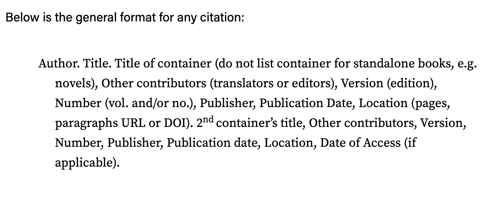

# Citations

<figure><figcaption></figcaption></figure>

* Aerospace Corporation. "Environmental Impacts of Rocket Launches". https://aerospace.org/environmental-impacts-rocket-launches.
* Antoni, EJ. “Wokeness Is Slowly Hollowing out the Fed.” _The Heritage Foundation_, www.heritage.org/markets-and-finance/commentary/wokeness-slowly-hollowing-out-the-fed. Accessed 19 July 2024
* Arendt, Hannah. _Eichmann in Jerusalem: A Report on the Banalty of Evil_. Penguin Books, 1964.
* Arendt, Hannah. _The Origins of Totalitarianism_. World Publishing Company, 1958.
* Aristophanes. “It’s Time to Save Literature from the Woke Publishing Industry.” _The Federalist_, 24 Oct. 2022, thefederalist.com/2022/10/25/its-time-to-save-literature-from-the-woke-publishing-industry/. Accessed 09 July 2024.
* Aristotle. “De Anima (on the Soul) .” _De Anima (On the Soul)_, antilogicalism.com/wp-content/uploads/2016/12/aristotle\_anima\_final.pdf. Accessed 23 Aug. 2024.
* Aristotle. _Nicomachean Ethics_. Translated by W. D. Ross, Batoche Books, 1999.
* Arnold, Bill T. _Genesis_. New Cambridge Bible Commentary, Cambridge University Press, 2009.
* Asad, Talal. _Genealogies of Religion: Discipline and Reasons of Power in Christianity and Islam_. Johns Hopkins Univ. Press, 1993.
* Ash, Harrison B. _On Agriculture_. Columella, Lucius Junius Moderatus. Harvard University Press, 1941. 3 vols.
* Al Awam, Ibn Mohammed Ibn Ahmed Ibn. Kitab Al- Filaha (Book of Agriculture). India, Repro Books Limited, 2017.
* Barron , Robert. “The Philosophical Roots of Wokeism.” _Acton Institute_, 8 Jan. 2024, www.acton.org/religion-liberty/volume-34-number-1/philosophical-roots-wokeism. Accessed 09 July 2024.
* Bartosch, Jo. “Beware Trans Ideas in Sheep’s Clothing.” _Spiked Beware Trans Ideas in Sheeps Clothing Comments_, spiked, 20 Nov. 2020, www.spiked-online.com/2020/11/19/beware-trans-ideas-in-sheeps-clothing/.
* Bateson, G. (1972). _Steps to an Ecology of Mind._ New York: Ballantine Books.
* Bateson, W. _Methods and Scope of Genetics_. Cambridge University Press, 1908.
* Bateson, William. _Mendel’s Principles of Heredity_. Cambridge University Press, 1909.
* Battelle Technology Partnership Practice. “Economic Impact of the Human Genome Project.” _Battelle Memorial Institute_ , May 2011, Accessed Aug. 2024.
* Baudrillard, Jean. _Simulacra and Simulation_. Translated by Sheila Faria Glaser, University of Michigan Press, 1994.
* Beckett, Andy. “Accelerationism: How a Fringe Philosophy Predicted the Future We Live In.” _The Guardian_, Guardian News and Media, 11 May 2017, www.theguardian.com/world/2017/may/11/accelerationism-how-a-fringe-philosophy-predicted-the-future-we-live-in.
* Berger, Peter L. _The Sacred Canopy: Elements of a Sociological Theory of Religion_. Open Road Media, 2011.
* Berger, Peter L., and Thomas Luckmann. _The Social Construction of Reality: A Treatise in the Sociology of Knowledge_. Penguin Books, 1991.
* Berlatsky, Noah. “Effective Altruism Is Neither Effective nor Altruistic.” _Effective Altruism Is Neither Effective Nor Altruistic_, Everything Is Horrible, 9 May 2024, www.everythingishorrible.net/p/effective-altruism-is-neither-effective.https://www.everythingishorrible.net/p/effective-altruism-is-neither-effective.
* Blackmore, Susan J. _The Meme Machine_. Oxford University Press, 2000.
* Boudreaux, Donald J. “The Childishness of Wokeism.” _AIER_, 24 Feb. 2023, www.aier.org/article/the-childishness-of-wokeism/. Accessed 12 July 2024.
* Bourdieu, Pierre. _Distinction: A Social Critique of the Judgement of Taste_. Translated by R. Nice, Harvard University Press, 1984.
* Bowlby, John. _Attachment and Loss_. Vol. 1, Penguin Books, 1971.
* Bowler, Peter J. _The Mendelian Revolution: The Emergence of Hereditarian Concepts in Modern Science and Society_. Bloomsbury Academic, 2015.
* Bowman, Abigail. “Space Launch System.” Edited by Lee Mohon, _NASA_, NASA, 11 July 2024, www.nasa.gov/reference/space-launch-system/.
* Brinkhof, Tim. “Here’s Why Sensory Perception Research Was Awarded A Nobel Prize.” _Freethink_, 11 Oct. 2021, www.freethink.com/science/2021-nobel-prize-for-medicine-is-awarded-to-work-on-sensory-perception-heres-why.
* Brodsky, Sascha. “Even the Creator of Chatgpt Finds Ai Scary, but Not Everyone Agrees.” _Lifewire_, Lifewire, 24 Feb. 2023, www.lifewire.com/even-the-creator-of-chatgpt-finds-ai-scary-but-not-everyone-agrees-7113525.
* Broughel, James. “Effective Altruism Contributed to the Fiasco at OpenAI.” _Forbes_, Forbes Magazine, 9 May 2024, www.forbes.com/sites/jamesbroughel/2023/11/20/effective-altruism-contributed-to-the-fiasco-at-openai/.
* Camus, A. (1988). _The Stranger_. New York: Alfred A. Knopf, Inc.
* Cancellieri, E., Bel Hadj Brahim, H., Ben Nasr, J. _et al._ A late Middle Pleistocene Middle Stone Age sequence identified at Wadi Lazalim in southern Tunisia. _Sci Rep_ 12, 3996 (2022). https://doi.org/10.1038/s41598-022-07816-x.
* The Center for Effective Altruism. “Effective Altruism Is about Doing Good Better.” _Effective Altruism_, Centre for Effective Altruism, www.effectivealtruism.org/. Accessed 4 Sept. 2024.
* Cheng, D. K. (2015). Field and Wave Electromagnetics. Pearson.
* Church, George M., and Ed Regis. _Regenesis: How Synthetic Biology Will Reinvent Nature and Ourselves_. Basic Books, 2012.
* Cosmides, Leda, and John Tooby. “Cognitive Adaptations for Social Change.” _The Adapted Mind: Evolutionary Psychology and the Generation of Culture_, Oxford University Press, New York, NY, 1992, pp. 163–228.
* Crick, F. H. C. The Origin of the Genetic Code. J. Mol. Biol. 38, 367–379 (1968).
* Crick, F.H.C., and James D. Watson. “Molecular’ Structure of Nucleic Acids.” _Nature_, Springer Nature Limited, 11 Aug. 2004, www.nature.com/scitable/content/16331/molecularstructureofDNAswatsoncrick.pdf.
* Darwin, Charles. _The Descent of Man and Selection in Relation to Sex_. vol. 1 2, John Murray: Albemarle Street, 1871, _MPG.PuRe Publication Repository_, https://pure.mpg.de/rest/items/item\_2309881\_7/component/file\_2309880/content.
* Dawkins, Richard. “The Selfish Gene.” _Al-Zaytoonah University of Jordan_, Al-Zaytoonah University, 1 May 2014, www.zuj.edu.jo/download/the-selfish-gene-r-dawkins-1976-ww-pdf/.
* de Villiers, R. (2022). The Human Brain – Cortex, Lobes, Neural Networks and Problem Solved!. In: de Villiers, R. (eds) The Handbook of Creativity & Innovation in Business. Springer, Singapore. https://doi.org/10.1007/978-981-19-2180-3\_2
* Deacon, Terrence William. _The Symbolic Species: The Co-Evolution of Language and the Brain_. W. W. Norton & Company, 1997.
* Deleuze, G. (1988). _Spinoza, practical philosophy_ San Francisco: City Lights Books.
* Deleuze, G. and Guattari, F. (1987). _A thousand plateaus_ Minneapolis: University of Minnesota Press.
* Dennett, Daniel C. _Breaking the Spell: Religion as a Natural Phenomenon_. Penguin Books, 2006.
* Dennett, Daniel C. _Darwin’s Dangerous Idea: Evolution and the Meaning of Life_. Penguin Books, 1996.
* Dennett, Daniel C. _Consciousness Explained_. Little, Brown and Company, 1991.
* Dennett, Daniel C. “The Evolution of Culture.” _The Monist_, vol. 84, no. 3, 2001, pp. 305–24. _JSTOR_, http://www.jstor.org/stable/27903733. Accessed 5 July 2024.
* Derrida, Jacques. _Of Grammatology_. Johns Hopkins University Press, 1998.
* Descartes, René. _Meditations on First Philosophy: With Selections from the Objections and Replies_. Translated by Michael Moriarty, Oxford University Press USA - OSO, 2008.
* Doniger, Wendy , Gold, Ann G. , Dimock, Edward C. , Smith, Brian K. , Basham, Arthur Llewellyn , Narayanan, Vasudha and Buitenen, J.A.B. van. "Hinduism". Encyclopedia Britannica, 2 Jul. 2024, https://www.britannica.com/topic/Hinduism. Accessed 7 July 2024.
* Doubek, James, et al. “‘Woke Racism’: John McWhorter Argues against What He Calls a Religion of Anti-Racism.” _NPR_, 6 Nov. 2021, www.npr.org/2021/11/05/1052650979/mcwhorters-new-book-woke-racism-attacks-leading-thinkers-on-race. Accessed 11 July 2024.
* Durkheim, Émile. _The Elementary Forms of Religious Life_. Translated by Karen E. Fields, Free Press, 1995.
* Earl, Brian. “The biological function of consciousness.” _Frontiers in Psychology_, vol. 5, 5 Aug. 2014, https://doi.org/10.3389/fpsyg.2014.00697.
* The Economist. “How Has the Meaning of the Word ‘Woke’ Evolved?” _The Economist_, The Economist Newspaper, 30 July 2021, www.economist.com/the-economist-explains/2021/07/30/how-has-the-meaning-of-the-word-woke-evolved.
* Eggleston, Ben. “Act utilitarianism,” in The Cambridge Companion to Utilitarianism, edited by Dale E. Miller (Cambridge University Press, 2014), pp. 125–145.
* Eliade, Mircea. _The Sacred and the Profane: The Nature of Religion_. Harcout, 1987.
* Elkins, J. (2001). ‘What is the Difference between the Body's Inside and Its Outside?’ In: S. Kuriyama, ed., _The Imagination of the Body and the History of Embodied Experience_ 1st ed. Kyoto: International Research Center for Japanese Studies, p.16.
* Emerson, Ralph W. (1993). Self-Reliance and Other Essays. New York: Dover Publications. &#x20;
* “Executive Order on the Safe, Secure, and Trustworthy Development and Use of Artificial Intelligence.” _The White House_, The United States Government, 30 Oct. 2023, www.whitehouse.gov/briefing-room/presidential-actions/2023/10/30/executive-order-on-the-safe-secure-and-trustworthy-development-and-use-of-artificial-intelligence/. Accessed 16 July 2024.
* “Fear Psychosis and the Cult of Safety – Why Are People so Afraid?” _Academy of Ideas | Free Minds for a Free Society_, 5 Nov. 2023, academyofideas.com/2022/04/fear-psychosis-and-the-cult-of-safety/. Accessed 08 July 2024.
* Fonda, Daren. “Culture Wars Are Hitting Companies. They’re Fighting Back.” _Barron’s_, www.barrons.com/articles/bud-light-woke-companies-culture-wars-c37da7b4. Accessed 09 July 2024.
* Foucault, Michel. _The Archaeology of Knowledge_. Translated by A. M. Sheridan Smith, Pantheon Books, 1972.
* Foucault, Michel. _Discipline and Punish: The Birth of the Prison_. Translated by Alan Sheridan, Random House, 1995.
* Foucault, Michel. _The History of Sexuality: An Introduction_. Translated by Robert Hurley, vol. 1, Pantheon, 1978.
* Foucault, Michel. _The History of Sexuality: Confessions of the Flesh_. Edited by Frédéric Gros. Translated by Robert Hurley, vol. 4, Pantheon Books, 2021.
* Foucault, Michel. _The History of Sexuality: The Care of the Self_. Translated by Robert Hurley, vol. 3, Pantheon Books, 1986.
* Foucault, Michel. _The History of Sexuality: The Use of Pleasure_. Translated by Robert Hurley, vol. 2, Vintage Books, 1990.
* Fridman, Lex. “#407 – Guillaume Verdon: Beff Jezos, E/ACC Movement, Physics, Computation & AGI.” _Apple Podcasts_, Apple Inc., 29 Dec. 2023, podcasts.apple.com/au/podcast/407-guillaume-verdon-beff-jezos-e-acc-movement-physics/id1434243584?i=1000640047523.
* Friedrich, Casper David, and Cody Delistraty. “Wanderer above the Sea of Fog.” _The Paris Review_, 27 Aug. 2018, Hamburger Kunsthalle, Hamburg, https://www.theparisreview.org/blog/2018/08/27/the-art-and-politics-of-wanderlust/. Accessed 7 Aug. 2024.
* Freud, Sigmund. _The Future of an Illusion_. Ed. & trans. by James Strachey, W. W. Norton & Company, Inc., 1969.
* Funk, Max. “Wokeism – the New Religion of the West.” _Converge Media_, 20 Feb. 2021, www.convergemedia.org/wokeism-the-new-religion-of-the-west/. Accessed 09 July 2024.
* Furedi, Frank. _How Fear Works: Culture of Fear in the Twenty-First Century_. Bloomsbury Continuum, 2018.
* Gardiner, M. E. (2017). Critique of Accelerationism. Theory, Culture & Society, 34(1), 29-52. https://doi.org/10.1177/0263276416656760
* Gerton, Jennifer L., and R. Scott Hawley. “Homologous chromosome interactions in meiosis: Diversity amidst conservation.” _Nature Reviews Genetics_, vol. 6, no. 6, June 2005, pp. 477–487, https://doi.org/10.1038/nrg1614.
* Gesteland, Raymond F, Thomas R. Cech, and John F. Atkins, eds. _The RNA World: The Nature of Modern RNA Suggests a Prebiotic RNA World_. 2nd ed., Cold Spring Harbor Laboratory Press, 1999.
* Girard, René. _Violence and the Sacred_ . Translated by Patrick Gregory, Paperback ed., Johns Hopkins University Press, 1979.
* Glover, Natasha. “The Banana Conjecture.” _Dessimoz Lab: Computational Evolutionary Biology_, 8 Dec. 2020, lab.dessimoz.org/blog/2020/12/08/human-banana-orthologs.
* Godoy, Jody, and Luc Cohen. “Bankman-Fried Sentenced to 25 Years for Multi-Billion Dollar FTX Fraud.” _Reuters_, Thomas Reuters, 28 Mar. 2024, www.reuters.com/technology/sam-bankman-fried-be-sentenced-multi-billion-dollar-ftx-fraud-2024-03-28/.
* Gramsci, Antonio. _Selections from the Prison Notebooks of Antonio Gramsci_. Edited by Quintin Hoare. Translated by Quintin Hoare and Geoffrey Nowell Smith, International Publishers, 1971.
* Griffiths, D. J. (2017). Introduction to Electrodynamics. Cambridge University Press.
* Habermas, Jurgen. _The Structural Transformation of the Public Sphere: An Enquiry into a Category of Bourgeois Society_. Translated by Frederick Lawrence and Thomas Burger, The M.I.T. Press, 1991.
* Halliday, D., Resnick, R., & Walker, J. (2013). Fundamentals of Physics. Wiley.
* Hanson, Victor Davis. “Wokeism Is a Cruel and Dangerous Cult.” _The Independent Institute_, 24 Jan. 2022, www.independent.org/news/article.asp?id=13968.
* Harari, Yuval Noah. _Sapiens: A Brief History of Humankind_. Signal: McClelland & Stewart, 2015.
* Haraway, Donna Jeanne. _A Cyborg Manifesto: Science, Technology, and Socialist-Feminism in the Late Twentieth Century_. University of Minnesota, 2016.
* Hayek, Friedrich A. _The Road to Serfdom_. University of Chicago Press, 1944.
* “Hearing Wrap Up: Federal Government Use of Artificial Intelligence Poses Promise, Peril.” _Committee on Oversight & Accountability_, Committee on Oversight & Accountability, 15 Sept. 2023, https://oversight.house.gov/release/hearing-wrap-up-federal-government-use-of-artificial-intelligence-poses-promise-peril/. Accessed 7 July 2024.
* Hegel, Georg Wilhelm Friedrich. _Phenomenology of Spirit_. Translated by A V Miller, Oxford University Press, 1977.
* Heidegger, Martin, et al. _Being and Time_. Blackwell, 1962.
* Heidegger, Martin. _The Question Concerning Technology and Other Essays_ . Translated by William Lovitt, Garland Publishing, Inc., 1977.
* Herbert, Frank. _Dune Chronicles: Dune_. Vol. 1, Ace Books, 1965.
* Herman, Edward S., and Noam Chomsky. _Manufacturing Consent: The Political Economy of the Mass Media_. The Bodley Head, 2008.
* Higgs, Paul G., and Niles Lehman. “The RNA world: Molecular Cooperation at the Origins of Life.” _Nature Reviews Genetics_, vol. 16, no. 1, 11 Nov. 2014, pp. 7–17, https://doi.org/10.1038/nrg3841.
* Holbraad, M., Pedersen, M. and Viveiros de Castro, E. (2014). The Politics of Ontology: Anthropological Positions. _Cultural Anthropology Online_, \[online] p.1. Available at: http://culanth.org/fieldsights/462-the-politics-of-ontology-anthropological-positions.
* Holzer, T. L., & Pampeyan, E. H. (1981). "Geological Considerations for High-Altitude Launch Sites." Geological Society of America Bulletin, 92(4), 193-204.
* Houlgate, Stephen. _An Introduction to Hegel: Freedom, Truth, and History_. Blackwell, 2006.
* Hughes, Brian, and Cynthia Miller-Idriss. “The January 6 Boost to Accelerationism.” _CTC Sentinel: Combating Terrorism at West Point_, 2021, pp. 14–18.
* Hyppolite, Jean. _Genesis and Structure of Hegel’s Phenomenology of Spirit_. Edited by James M Edie. Translated by Samuel Cherniak and John Heckman, Northwestern University Press, 1974.
* “Idiocracy.” Twentieth Century-Fox Film Corporation, 2006.
* Ingold, Tim. _Being Alive: Essays on Movement, Knowledge and Description_. Routledge, 2011.
* Ingold. _The Perception of the Environment: Essays on Livelihood, Dwelling and Skill_. Routledege, 2011.
* Ireland, John D. _The UDĀNA: Inspired Utterances of the Buddha_. Buddhist Publication Society, 1997.
* Jacobson, Stanley, et al. _Neuroanatomy for the Neuroscientist_, 2018, https://doi.org/10.1007/978-3-319-60187-8.
* Jung, C. G. _The Collected Works of C. G. Jung: Vol. 9 Pt. II, AION: Researches into the Phenomenology of the Self._ Edited by Herbert Read et al. Translated by Richard F. C. Hull, 2nd ed., vol. 9 20, Princeton University Press, 1959.
* Jung, C. G. _The Collected Works of C. G. Jung: Vol. 9. Pt. I. The Archetypes and the Collective Unconscious_. Edited by William McGuire et al. Translated by Richard F. C. Hull and Gerhard Adler, 2nd ed., vol. 9 20, Princeton University Press, 1969.
* Kaewkongkaew, K., Phien-Wej, N, (2015). Prediction of rock mass along tunnels by geostatistics&#x20;
* Kao, Emilie. “Woke Gender.” _The Heritage Foundation_, www.heritage.org/gender/commentary/woke-gender. Accessed 09 July 2024.
* Kasulis, T., Ames, R. and Dissanayake, W. (1993). _Self as body in Asian theory and practice_ Albany: State University of New York Press.
* Kauffman, Stuart A. _Investigations_. Oxford University Press, 2000.
* Kierkegaard, Søren. _Fear and Trembling_. Translated by Alastair Hannay, Penguin Books, 1986.
* Knight, Will. “Why Elon Musk Had to Open Source Grok, His Answer to Chatgpt.” _Wired_, Conde Nast, 11 Mar. 2024, www.wired.com/story/elon-musk-no-choice-open-chatbot-grok/.
* Komjathy, L. (2007). _Cultivating perfection_ Leiden: Brill.
* Krantz-Kent, Rachel. “Television, Capturing America’s Attention at Prime Time and Beyond.” _U.S. Bureau of Labor Statistics_, United States Department of Labor, Sept. 2018, www.bls.gov/opub/btn/volume-7/television-capturing-americas-attention.htm.
* Kuriyama, S. (1999). _The expressiveness of the body and the divergence of Greek and Chinese medicine_. New York: Zone Books.
* Kuriyama, S. (2001). ‘The Imagination of the Body and the History of Embodied Experience: The Case of Chinese Views of the Viscera’ In: S. Kuriyama, ed., _The Imagination of the Body and the History of Embodied Experience_ 1st ed. Kyoto: International Research Center for Japanese Studies, pp. 16-29.
* Kurzweil, Ray. _The Singularity Is Near: When Humans Transcend Biology_. Viking Penguin, 2005.
* Lakoff, George, and Mark Johnson. _Metaphors We Live By_. University of Chicago Press, 1980.
* Lamarck, Jean Baptiste De. _Zoological Philosophy: An Exposition with Regard to the Natural History of Animals_. Translated by Hugh Elliot, MacMillan and Co., Limited, 1914.
* Lang, Hannah. “Sam Bankman-Fried’s Sudden Turn from White Knight to Washout.” _Reuters_, Thomas Reuters, www.reuters.com/technology/sam-bankman-frieds-sudden-turn-white-knight-washout-2022-11-12/. Accessed 27 Aug. 2024.
* Latour, Bruno. _Reassembling the Social: An Introduction to Actor-Network-Theory_. Oxford University Press, 2005.
* Lévi-Strauss, Claude. _Structural Anthropology_. Translated by Brooke Grundfest Schoepf and Claire Jacobson, Basic Book, 1963.
* Lewis, Ralph. “The Evolutionary Origins of Consciousness.” _Psychology Today_, Sussex Publishers, 1 Oct. 2020, www.psychologytoday.com/us/blog/finding-purpose/202010/the-evolutionary-origins-consciousness.
* Li, T., Cai, M., & Cai, M. (2007). A review of mining-induced seismicity in China. International Journal of Rock Mechanics and Mining Sciences, 44(8).
* Lindsay, James. “No, the Woke Won’t Debate You. Here’s Why.” _New Discourses_, 25 Apr. 2021, newdiscourses.com/2020/07/woke-wont-debate-you-heres-why/. Accessed 11 July 2024.
* Lindsay, James. “The Rise of the Woke Cultural Revolution.” _New Discourses_, 14 Apr. 2021, newdiscourses.com/2021/04/rise-woke-cultural-revolution/. Accessed 11 July 2024.
* Logsdon, John. "Space Policy: An Introduction." Wiley, 2011.
* Long, K. F. (2012). Deep Space Propulsion: A Roadmap to Interstellar Flight. Springer.
* Lovecraft, H. P. “Supernatural Horror in Literature.” _Supernatural Horror in Literature_, 16 Oct. 2014, web.seducoahuila.gob.mx/biblioweb/upload/supernatural\_horror\_in\_literature.pdf. Accessed 08 July 2024.
* Luhmann, Niklas. _Social Systems_. Translated by Dirk Baecker and John Bednarz, Stanford University Press, 1995.
* MacColl, Margaux. “‘It’s a Cult’: Inside Effective Accelerationism, the Pro-AI Movement Taking Over Silicon Valley.” _The Information_, 7 Oct. 2023, www.theinformation.com/articles/its-a-cult-inside-effective-accelerationism-the-pro-ai-movement-taking-over-silicon-valley.
* “Mace Announces Second Hearing on White House Executive Order on AI.” _Committee on Oversight & Accountability_, Committee on Oversight & Accountability, 15 Mar. 2024, https://oversight.house.gov/release/mace-announces-second-hearing-on-white-house-executive-order-on-ai/. Accessed 7 July 2024.
* MacIntyre, Alasdair. _After Virtue: A Study in Moral Theory_. 3rd ed., University of Notre Dame Press, 2007.
* Marcuse, Herbert. _One-Dimensional Man: Studies in the Ideology of Advanced Industrial Society_. 2nd ed., Routledge, 2002.
* Margulis, Lynn. _Symbiosis in Cell Evolution: Life and Its Environment on the Early Earth_. W.H. Freeman, 1981.
* Mark, Joshua J. "Burial in Ancient Mesopotamia." _World History Encyclopedia_, 2014, pp. 44-45.
* Mark, Joshua J. “Hinduism.” _World History Encyclopedia_, World History Encyclopedia, 8 June 2020, www.worldhistory.org/hinduism/.
* Marks, Jonathan. “Studyguide for the Alternative Introduction to Biological Anthropology.” _Internet Archive_, Cram101, 13 Aug. 2013, archive.org/details/studyguideforalt0000cram/page/99/mode/2up. Accessed 23 July 2024.
* Marks, Jonathan. The Alternative Introduction to Biological Anthropology. United Kingdom, OUP USA, 2011.
* Marx, Karl, and Andy Blunden. _Critique of Hegel’s Philosophy of Right_. Translated by Joseph O’Malley, Oxford University Press, 1970. _Marxists Internet Archive_, https://www.marxists.org/archive/marx/works/download/Marx\_Critique\_of\_Hegels\_Philosophy\_of\_Right.pdf. Accessed 5 Sept. 2024.
* Marx, Karl, and Friedrich Engels. _The German Ideology: Including Theses on Feuerbach and Introduction to the Critique of Political Economy_. Prometheus Books, 1998.
* Maynard Smith, John, and Eörs Szathmáry. _The Major Transitions in Evolution_. Oxford University Press, 1997.
* Mayr, Ernst. _Systematics and the Origin of Species: From the Viewpoint of a Zoologist_. Columbia University Press, 1942.
* Mayr, Ernst. _The Growth of Biological Thought: Diversity, Evolution, and Inheritance_. Belknap Press of Harvard University Press, 1982.
* McClintock, Barbara. _The Discovery and Characterization of Transposable Elements: The Collected Papers of Barbara McClintock_. Garland Pub, 1987.
* McGoey, Linsey. “Elite Universities Gave Us Effective Altruism, the Dumbest Idea of the Century.” _Jacobin_, jacobin.com/2023/01/effective-altruism-longtermism-nick-bostrom-racism. Accessed 27 Aug. 2024.
* McLuhan, Marshall. _Understanding Media: The Extensions of Man_. 2nd ed., Gingko Press, 2013.
* McMillan, Robert and Deepa Seetharaman. “How Effective Altruism Split Silicon Valley—and Fueled the Blowup at Openai .” _The Wall Street Journal_, www.wsj.com/tech/ai/openai-blowup-effective-altruism-disaster-f46a55e8. Accessed 27 Aug. 2024.
* Mendel, Gregor. “Experiments on Plant Hybridization.” Natural History Society of Brünn. February 8th, and March 8th, 1865, meetings of the Brünn Natural History Society, 4 Sept. 2024, Brünn, _Electronic Scholarly Publishing Project_, http://www.esp.org/. Accessed 4 Sept. 2024.
* Mesoudi, A. (2011). _Cultural evolution: How Darwinian theory can explain human culture and synthesize the social sciences._ Chicago, IL: University of Chicago Press.&#x20;
* Meyers, M. A., & Chawla, K. K. (2009). Mechanical Behavior of Materials. Cambridge University Press.
* McGinnis, John O. “Why Wokeism Threatens the Rule of Law.” _Law & Liberty_, 25 Nov. 2020, lawliberty.org/why-wokeism-threatens-the-rule-of-law/. Accessed 12 July 2024.
* Mill, John Stuart. _On Liberty_. PDF, 3rd ed., Longman, Green, Longman, Roberts, & Green, 1864. _Internet Archive_, https://ia801308.us.archive.org/13/items/onliberty00inmill/onliberty00inmill.pdf. Accessed 5 Sept. 2024.
* Mintz, Steven. “Does Wokeness Threaten Academic Freedom?” _Inside Higher Ed | Higher Education News, Events and Jobs_, www.insidehighered.com/blogs/higher-ed-gamma/does-wokeness-threaten-academic-freedom. Accessed 09 July 2024.
* Mises, Ludwig Von. _Human Action_. Ludwig von Mises Institute, 1998.
* Mizuuchi, Ryo, et al. “Evolutionary transition from a single RNA replicator to a multiple Replicator Network.” _Nature Communications_, vol. 13, no. 1, 18 Mar. 2022, https://doi.org/10.1038/s41467-022-29113-x.
* Moon, F. C. (2008). Superconducting Levitation: Applications to Bearings and Magnetic Transportation. Wiley-VCH.
* Moran, Dermot. (2012). Husserl’s Crisis of the European Sciences and Transcendental Phenomenology. An Introduction. 10.1017/CBO9781139025935.
* Morgan, Thomas Hunt. _The Mechanism of Mendelian Heredity_. Revised ed., Henry Holt and Company, 1915.
* Mudrik, Liad. “Consciousness: What It Is, Where It Comes from - and Whether Machines Can Have It.” _Nature News_, Nature Publishing Group, 30 Oct. 2023, www.nature.com/articles/d41586-023-03335-5.
* Musk, Elon. "Making Humans a Multiplanetary Species." New Space, 2017.
* Musk, Elon. “X.Com.” _X (Formerly Twitter)_, 11 Aug. 2017, x.com/elonmusk/status/896166762361704450.
* Neiman, Susan. “The Fatal Tension at the Heart of Wokeism.” _Time_, 27 June 2023, time.com/6290367/susan-neiman-tension-at-the-heart-of-wokeism/. Accessed 09 July 2024.
* Nielsen, Jakob. “AI: First New UI Paradigm in 60 Years.” _Nielsen Norman Group_, 30 Jan. 2024, www.nngroup.com/articles/ai-paradigm/.
* Nietzsche, F. W. _The Antichrist_. Translated by H. L. Mencken, Alfred A. Knopff, Inc., 1931.
* Nietzsche, Friedrich Wilhelm. _The Gay Science: With a Prelude in Rhymes and an Appendix of Songs_. Translated by Walter Kaufmann, Vintage Books, 1974.
* Nietzsche, Friedrich Wilhelm. _Thus Spake Zarathustra_. Translated by Thomas Common, Modern Library, 1960.
* Nietzsche, Friedrich. _Beyond Good and Evil_. Translated by Helen Zimmern, The Modern Library, 1885.
* Nietzsche, Friedrich. _The Will to Power_ . Edited by Walter Arnold Kaufmann. Translated by Reginald John Hollingdale and Walter Arnold Kaufmann, Vintage Books, 1968.
* Noys, B.. (2010). The Persistence of the Negative. The Persistence of the Negative.
* Orgel, Leslie E. “The Origin of Life on Earth.” _Scientific American_, Oct. 1994, pp. 76–83.
* Ostrom, Elinor. _Governing the Commons: The Evolution of Institutions for Collective Action_. Cambridge University Press, 1990.
* Papastavrou, Nikolaos, et al. “RNA-catalyzed evolution of catalytic RNA.” _Proceedings of the National Academy of Sciences_, vol. 121, no. 11, 4 Mar. 2024, https://doi.org/10.1073/pnas.2321592121.
* Parker, Jade. “Accelerationism in America: Threat Perceptions.” _GNET_, 4 Feb. 2020, gnet-research.org/2020/02/04/accelerationism-in-america-threat-perceptions/.
* Parker Pearson, Michael. "The Oxford Handbook of the Archaeology of Death and Burial." Oxford University Press, 2013, pp. 28-29.
* Pelligra, Vittorio, and Pier Luigi Sacco. “Searching for meaning in a post-scarcity society. implications for creativity and job design.” _Frontiers in Psychology_, vol. 14, 12 Sept. 2023, https://doi.org/10.3389/fpsyg.2023.1198424.
* Peterson, Jordan B. _12 Rules for Life: An Antidote to Chaos_. Allen Lane, 2018.
* Poojar , Niranjan  B. “The Origin and Evolution of Wokeism: Unveiling Its Theoretical Foundations and Implications for Bharat - SamvadaWorld.” _Samvada World_, 15 Apr. 2024, samvadaworld.com/national/the-origin-and-evolution-of-wokeism-unveiling-its-theoretical-foundations-and-implications-for-bharat/.
* Provine, William B. “Ernst Mayr.” _Genetics_, vol. 167, no. 3, 1 July 2004, pp. 1041–1046, https://doi.org/10.1093/genetics/167.3.1041.
* Ratcliff, William  C., et al. “Experimental Evolution of Multicellularity.” Edited by Richard E. Lenski. _PNAS_, vol. 109, no. 5, 31 Jan. 2012, pp. 1595–1600, https://doi.org/https://doi.org/10.1073/pnas.1115323109.
* Reiff, Nathan. “The Collapse of FTX: What Went Wrong with the Crypto Exchange?” _Investopedia_, Investopedia, 6 June 2024, www.investopedia.com/what-went-wrong-with-ftx-6828447.
* Roach, Brian, et al. “Consumption and the Consumer Society.” _A GDAE Teaching Module on Social and Environmental Issues in Economics_, Routledge, www.bu.edu/eci/files/2019/10/Consumption\_and\_Consumer\_Society.pdf. Accessed 19 July 2024.
* Roll-Hansen, Nils. “The Genotype Theory of Wilhelm Johannsen and Its Relation to Plant Breeding and the Study of Evolution.” Centaurus 22.3 (1979): 201–235. Web.
* Roose, Kevin. “The Brilliance and Weirdness of Chatgpt.” _The New York Times_, The New York Times, 5 Dec. 2022, www.nytimes.com/2022/12/05/technology/chatgpt-ai-twitter.html.
* Ross, James Perren. “Outlasting the Dinosaurs.” _NOVA_, PBS, Dec. 2023.
* Sabatini, Jesse J., and Karl D. Oyler. “Recent Advances in the Synthesis of High Explosive Materials.” _MDPI_, Multidisciplinary Digital Publishing Institute, 29 Dec. 2015, www.mdpi.com/122904.
* Sagan, Carl. _Cosmos_. Random House, 1980.
* Said, Edward W. _Culture and Imperialism_. Vintage Books, 1994.
* Sartre, Jean-Paul. _Being and Nothingness: An Essay on Phenomenological Ontology._ Washington Square Press, 1953.
* Sartre, Jean-Paul. _Existentialism Is a Humanism_. Edited by John Kulka. Translated by Carol Macomber, Yale University Press, 2007.
* Schmitz, Matthew. “The Woke and the Un-Woke.” _Tablet Magazine_, 25 Sept. 2020, www.tabletmag.com/sections/news/articles/woke-religion-america. Accessed 09 July 2024.
* Sen, Gautam. “How the Woke Are Impacting Politics and Foreign Policy.” _Globalorder_, 16 Jan. 2023, www.globalorder.live/post/how-the-woke-are-impacting-politics-and-foreign-policy. Accessed 11 July 2024.
* Shapiro, M.L., Riceberg, J.S., Seip-Cammack, K., Guise, K.G. (2014). Functional Interactions of Prefrontal Cortex and the Hippocampus in Learning and Memory. In: Derdikman, D., Knierim, J. (eds) Space, Time and Memory in the Hippocampal Formation. Springer, Vienna. https://doi.org/10.1007/978-3-7091-1292-2\_19
* Shepherd, Artis. “Fear Is the Mind Killer: America’s Dangerous Obsession with ‘Safety.’” _Mises Institute_, 17 July 2024, mises.org/mises-wire/fear-mind-killer-americas-dangerous-obsession-safety. Accessed 19 July 2024.
* Sloterdijk, Peter. _You Must Change Your Life_. Translated by Wieland Hoban, John Wiley & Sons, 2014.
* Smolla, Marco, et al. (2021) Underappreciated features of cultural evolution. Phil. Trans. R. Soc. B 376: 20200259. https://doi.org/10.1098/rstb.2020.0259
* Smil, V. (2017). Energy and Civilization: A History. MIT Press.
* Smith, Adam, and Jim Manis. _An Inquiry into the Nature and Causes of the Wealth of Nations_. PSU Electronic Classics Series, 2005.
* Sowell, Thomas. _Intellectuals and Society_. Basic Books, 2011.
* Statista. “Japan: Religious Affiliations in 2021.” _Statista_, 2024, www.statista.com/statistics/1001602/japan-religious-affiliation/. Accessed 7 July 2024.
* Stark, Rodney William. _The Rise of Christianity: How the Obscure, Marginal Jesus Movement Became the Dominant Religious Force in the Western World in a Few Centuries_. HarperSanFrancisco, 1997.
* Strong, Tracy B. “Nietzsche and the Critique of Religion.” _Nietzsche and the Antichrist: Religion, Politics, and Culture in Late Modernity_, edited by Conway, et al., Bloomsbury, London, England, 2018, pp. 141–158.
* Swayne, Matt. “Scientists Uncover the Genetic Pathway That Colors Bumble Bee Stripes.” _Phys.Org_, Phys.org, 22 Oct. 2021, phys.org/news/2021-10-scientists-uncover-genetic-pathway-bumble.html.
* Taleb, Nassim Nicholas. _Antifragile: Things That Gain from Disorder_. Random House, 2012.
* Tarantola, Andrew. “OpenAI Fires CEO Sam Altman as ‘board No Longer Has Confidence’ in His Leadership.” _Engadget_, Engadget, 18 Nov. 2023, www.engadget.com/openai-ceo-sam-altman-ousted-as-board-no-longer-has-confidence-in-his-leadership-204924006.html.
* Templeton AR. Has human evolution stopped? Rambam Maimonides Med J. 2010 Jul 2;1(1):e0006. doi: 10.5041/RMMJ.10006. PMID: 23908778; PMCID: PMC3721656.
* Thoraval, Yannick. “Education: Opinion.” _The Sydney Morning Herald_, 23 Mar. 2023, www.smh.com.au/education/i-m-a-university-lecturer-and-wokeism-is-stifling-free-debate-in-my-classroom-20230316-p5csor.html. Accessed 9 July 2024.
* Thoraval, Yannick. “Wokeim Stifles Debate at Universities.” _The Sydney Morning Herald_, 24 Mar. 2023, www.smh.com.au/education/i-m-a-university-lecturer-and-wokeism-is-stifling-free-debate-in-my-classroom-20230316-p5csor.html. Accessed 12 July 2024.
* Twidell, J., & Weir, T. (2015). Renewable Energy Resources. Routledge.
* Turner, T. (2009). ‘The Crisis of Late Structuralism. Perspectivisim and Animism: Rethinking Culture, Nature, Spirit, and Bodiliness’ _Tipití­:_ Journal of the Society for the Anthropology of Lowland South America 7(1), p.34.
* Turner, De Sales, and Helen Cox. “Facilitating Post Traumatic Growth.” _Health and Quality of Life Outcomes_, vol. 2, no. 1, 13 July 2004. _34_, https://doi.org/10.1186/1477-7525-2-34.
* Tyrrell, Patrick. “What Is Wrong with ‘ESG’ Wokeism.” _The Heritage Foundation_, www.heritage.org/progressivism/commentary/what-wrong-esg-wokeism. Accessed 12 July 2024.
* University of Oxford. “8.2% of Our DNA Is ‘Functional.’” _University of Oxford_, 25 July 2015, www.ox.ac.uk/news/2014-07-25-82-our-dna-%E2%80%98functional%E2%80%99.
* University of Tokyo. “New Insight into Possible Origins of Life: For the First Time Researchers Create an RNA Molecule That Replicates.” _SciTechDaily_, 18 Mar. 2022, scitechdaily.com/new-insight-into-possible-origins-of-life-for-the-first-time-researchers-create-an-rna-molecule-that-replicates/.
* Venter, J Craig. “A DNA-Driven World.” The 32nd Richard Dimbleby Lecture. 2024, London, The Design Museum.
* Veysset, David, et al. “High-velocity micro-projectile impact testing.” _Applied Physics Reviews_, vol. 8, no. 1, 1 Mar. 2021, https://doi.org/10.1063/5.0040772.
* Wang, Fengchao, et al. “Rock breaking performance of TBM disc cutter assisted by high-pressure water jet.” _Applied Sciences_, vol. 10, no. 18, 10 Sept. 2020, p. 6294, https://doi.org/10.3390/app10186294.
* Wanscher, Johan Henrik. “An Analysis of Wilhelm Johannsen’s Genetical Genotype “term ...” _An Analysis of Wilhelm Johannsen’s Term ”genotype” 1909-26_ , 1975, onlinelibrary.wiley.com/doi/abs/10.1111/j.1601-5223.1975.tb01456.x.
* Waring, T. M., Wood, Z. T. Long-term gene–culture coevolution and the human evolutionary transition. _Proceedings of the Royal Society B: Biological Sciences_, 2021; 288 (1952): 20210538 DOI: 10.1098/rspb.2021.0538
* Weber, Max. _The Protestant Ethic and the Spirit of Capitalism_. Edited by Anthony Giddens. Translated by Talcott Parsons, Routledge, 2005.
* Weissenberger, John. “Wokism: A Symptom of ‘Late-Stage Capitalism’?” _C2C Journal_, 17 Nov. 2023, c2cjournal.ca/2023/10/wokism-a-symptom-of-late-stage-capitalism/. Accessed 09 July 2024.
* West, Darrell. “Senate Hearing Highlights AI Harms and Need for Tougher Regulation.” _Brookings_, 27 June 2023, www.brookings.edu/articles/senate-hearing-highlights-ai-harms-and-need-for-tougher-regulation/.
* Wheeler, J. A., & Taylor, E. F. (1966). Spacetime Physics: Introduction to Special Relativity. W.H. Freeman and Company.
* Whitehead, Alfred North. _Process and Reality: A Essay in Cosmology_. Edited by David Ray Griffin and Donald Wynne Sherburne, The Free Press, 1978.
* Whitehead, Alfred North. “The Concept of Nature: The Tarner Lectures, Delivered in Trinity College, November 1919.” _The Project Gutenberg eBook of The Concept of Nature, by A. N. Whitehead._, 8 Aug. 2024, www.gutenberg.org/cache/epub/18835/pg18835-images.html.
* Whitman, W. (1983). _Leaves of Grass._ New York: Bantam Books.&#x20;
* Wilford, Denette. “Is the Woke Revolution Killing Hollywood?” _The Toronto Sun_, torontosun.com/entertainment/movies/is-the-woke-revolution-killing-hollywood. Accessed 12 July 2024.
* Williams, Alex, and Nick Srineck. “#ACCELERATE Manifesto for an Accelerationist Politics.” _Critical Legal Thinking_, 14 Feb. 2021, criticallegalthinking.com/2013/05/14/accelerate-manifesto-for-an-accelerationist-politics/.
* Wilson, Edward O. _Sociobiology: The New Synthesis_. Twenty-fifth Anniversary ed., Belknap Press of Harvard University Press, 2000.
* Woese, Carl R. _The Genetic Code: The Molecular Basis for Genetic Expression_. Harper & Row, 1967.
* Wood, Roger. (1973). Robert Bakewell (1725-1795), pioneer animal breeder, and his influence on Charles Darwin.. Folia mendeliana. 58. 231-42.
* Wormald, Benjamin. “Hindus.” _Pew Research Center_, Pew Research Center, 2 Apr. 2015, www.pewresearch.org/religion/2015/04/02/hindus/.
* Young, H. D., & Freedman, R. A. (2015). University Physics with Modern Physics. Pearson.
* Zampieri, F. Chapter 43. The Impact of Modern Medicine on Human Evolution. Michel Tibayrenc, Francisco J. Ayala, Eds. On Human Nature, Academic Press, 2017, Pages 707-727, ISBN 9780124201903, https://doi.org/10.1016/B978-0-12-420190-3.00043-0.
* Zizek, Slavoj. _The Sublime Object of Ideology_. 2nd ed., Verso, 2008.
* Zohary, Daniel, and Maria Hopf. _Domestication of Plants in the Old World_. Oxford University Press, 2001.
* Zubrin, Robert. "The Case for Mars: The Plan to Settle the Red Planet and Why We Must." Free Press, 1996.
* **Miller, Stanley L., and Harold C. Urey.** "Organic Compound Synthesis on the Primitive Earth." _Science_, vol. 130, no. 3370, 1959, pp. 245-251.
* **Deamer, David, and J. P. Dworkin.** "Chemistry and Physics of Primitive Membranes." _Astrobiology_, vol. 5, no. 4, 2005, pp. 499-514.
* **Oparin, A. I.** _The Origin of Life on Earth_. Dover Publications, 1953.
* **Orgel, Leslie E.** "Prebiotic Chemistry and the Origin of the RNA World." _Critical Reviews in Biochemistry and Molecular Biology_, vol. 39, no. 2, 2004, pp. 99-123.
* **Szostak, Jack W., David P. Bartel, and Pier Luigi Luisi.** "Synthesizing Life." _Nature_, vol. 409, no. 6818, 2001, pp. 387-390.
* **Lazcano, Antonio, and Stanley L. Miller.** "How Long Did It Take for Life to Begin and Evolve to Cyanobacteria?" _Journal of Molecular Evolution_, vol. 39, no. 6, 1994, pp. 546-554.
* **Lenton, Timothy M., and Andrew Watson.** _Revolutions That Made the Earth_. Oxford University Press, 2011.
* **Margulis, Lynn.** _Symbiotic Planet: A New Look at Evolution_. Basic Books, 1998.
* **Gould, Stephen Jay.** _Wonderful Life: The Burgess Shale and the Nature of History_. W. W. Norton & Company, 1989.
* **Knoll, Andrew H.** _Life on a Young Planet: The First Three Billion Years of Evolution on Earth_. Princeton University Press, 2003.
* **Falkowski, Paul G.** "Traces of Life." _Science_, vol. 311, no. 5760, 2006, pp. 1030-1034.
* **Jablonka, Eva, and Marion J. Lamb.** _Evolution in Four Dimensions: Genetic, Epigenetic, Behavioral, and Symbolic Variation in the History of Life_. MIT Press, 2006.
* **Dawkins, Richard.** _The Selfish Gene_. Oxford University Press, 1976.
* **Boyd, Robert, and Peter J. Richerson.** _Culture and the Evolutionary Process_. University of Chicago Press, 1985.
* **Diamond, Jared.** _Guns, Germs, and Steel: The Fates of Human Societies_. W. W. Norton & Company, 1997.
* **Ward, Peter D., and Donald Brownlee.** _Rare Earth: Why Complex Life Is Uncommon in the Universe_. Springer, 2000.
* **Kasting, James F.** _How to Find a Habitable Planet_. Princeton University Press, 2010.
* **Cockell, Charles S.** _Astrobiology: Understanding Life in the Universe_. Wiley, 2018.
* **Hawking, Stephen.** _Brief Answers to the Big Questions_. Bantam Books, 2018.
* **Sagan, Carl.** _Cosmos_. Random House, 1980.
* **Carruthers, Peter.** _The Opacity of Mind: An Integrative Theory of Self-Knowledge_. Oxford University Press, 2011.
* **Margulis, Lynn, and Dorion Sagan.** _Acquiring Genomes: A Theory of the Origins of Species_. Basic Books, 2002.
* **Kurzweil, Ray.** _The Singularity Is Near: When Humans Transcend Biology_. Viking, 2005.
* "Advances in Tunnel and Underground Construction," MDPI "
* Tunnels and Underground Excavations - Tunneling Techniques," Britannica&#x20;
* https://www.mdpi.com/journal/buildings/special\_issues/Tunnel\_Construction&#x20;
* Introduction to Tunnel Design and Construction. (n.d.). American Society of Civil Engineers (ASCE).&#x20;
* Artificial intelligence in tunnel construction: A comprehensive review. (2021). ScienceDirect.&#x20;
* https://mine.nridigital.com/mine\_dec23/tunnelling-machinery-drilling-technology&#x20;
* https://www.mdpi.com/journal/applsci/special\_issues/25QOTNROL7&#x20;
* **Gould, Stephen Jay.** _Wonderful Life: The Burgess Shale and the Nature of History_. W. W. Norton & Company, 1989.
* **Hawkey, A.** "The Human Body in Space: Distinguishing Fact from Fiction." _Advances in Physiology Education_, vol. 27, no. 3, 2003, pp. 176-181.
* **Vico, L., et al.** "Effects of Long-Term Microgravity Exposure on Cancellous and Cortical Weight-Bearing Bones of Cosmonauts." _The Lancet_, vol. 355, no. 9215, 2000, pp. 1607-1611.
* **Cucinotta, F. A., et al.** "Space Radiation and Cataracts in Astronauts." _Radiation Research_, vol. 156, no. 5, 2001, pp. 460-466.
* **Sandal, Gro Mjeldheim, et al.** "Psychological Responses during Simulation of a 520-Day Space Mission." _Aviation, Space, and Environmental Medicine_, vol. 82, no. 2, 2011, pp. 135-142.
* **Suedfeld, Peter, et al.** "The Role of Stress in Mars 500: Research and Observations from a 520-Day Simulated Space Mission." _Frontiers in Psychology_, 27 Nov. 2009, www.frontiersin.org/articles/10.3389/fpsyg.2017.00795/full.
* **Kahneman, Daniel.** _Thinking, Fast and Slow_. Farrar, Straus and Giroux, 2011.
* **Leach, John.** "Why People ‘Freeze’ in Life-Threatening Situations: Implications for Resilience Training." _NATO Science for Peace and Security Series E: Human and Societal Dynamics_, vol. 111, 2004, pp. 19-23.
* **Lovell, James, and Jeffrey Kluger.** _Apollo 13_. HarperCollins, 2006.
* **Shklovskii, I. S., and Carl Sagan.** _Intelligent Life in the Universe_. Holden-Day, 1966.
* **Spudis, Paul D.** "Our Technologies Are Inadequate for Deep Space Exploration." _Scientific American_, 2016.
* **NASA.** "Mars Science Laboratory: Curiosity Rover." 2020, mars.nasa.gov/msl/mission/overview/.
* **Sagan, Carl.** _The Demon-Haunted World: Science as a Candle in the Dark_. Random House, 1996.
* [https://sadil.ws/bitstream/handle/123456789/329/B22.pdf?sequence=1\&isAllowed=y](https://sadil.ws/bitstream/handle/123456789/329/B22.pdf?sequence=1\&isAllowed=y)
* **Chalmers, David J.** _The Conscious Mind: In Search of a Fundamental Theory_. Oxford University Press, 1996.
* **Hofstadter, Douglas R.** _Gödel, Escher, Bach: An Eternal Golden Braid_. Basic Books, 1979.
* **Harari, Yuval Noah.** _Sapiens: A Brief History of Humankind_. Harper, 2015.
* **Russell, Stuart J., and Peter Norvig.** _Artificial Intelligence: A Modern Approach_. Prentice Hall, 2010.
* **Tegmark, Max.** _Life 3.0: Being Human in the Age of Artificial Intelligence_. Knopf, 2017.
* **Moravec, Hans.** _Robot: Mere Machine to Transcendent Mind_. Oxford University Press, 1999.
* **Kurzweil, Ray.** _The Singularity Is Near: When Humans Transcend Biology_. Viking, 2005.
* **Einstein, Albert.** _Ideas and Opinions_. Crown Publishers, 1955.
* **Boden, Margaret A.** _Mind as Machine: A Historyof Cognitive Science_. Oxford University Press, 2006.
* **Blackmore, Susan.** _The Meme Machine_. Oxford University Press, 1999.
* **Dennett, Daniel C.** _Consciousness Explained_. Little, Brown and Company, 1991.
* Capra, Fritjof. _The Tao of Physics: An Exploration of the Parallels Between Modern Physics and Eastern Mysticism_. Shambhala Publications, 1975.
* Ford, Martin. _Architects of Intelligence: The Truth About AI from the People Building It_. Packt Publishing, 2018.
* Krauss, Lawrence M. _The Physics of Star Trek_. Harper Perennial, 2007.
* Moravec, Hans. _Mind Children: The Future of Robot and Human Intelligence_. Harvard University Press, 1988.
* Penrose, Roger. _The Road to Reality: A Complete Guide to the Laws of the Universe_. Vintage, 2007.
* Prigogine, Ilya. _The End of Certainty: Time, Chaos, and the New Laws of Nature_. Free Press, 1997.
* Schneider, Susan. _Artificial You: AI and the Future of Your Mind_. Princeton University Press, 2019.
* Schrödinger, Erwin. _What Is Life? The Physical Aspect of the Living Cell_. Cambridge University Press, 1944.
* Smil, Vaclav. _Energy and Civilization: A History_. MIT Press, 2017.
* Tyson, Neil deGrasse. _Astrophysics for People in a Hurry_. W. W. Norton & Company, 2017
* **Bostrom, Nick**. _Superintelligence: Paths, Dangers, Strategies_. Oxford University Press, 2003.
* **Boyd, Robert, and Peter J. Richerson**. _Culture and the Evolutionary Process_. University of Chicago Press, 1985.
* **Dennett, Daniel C.**. _Consciousness Explained_. Little, Brown and Company, 1991.
* **Mizuuchi, Ryo, et al.**. “Evolutionary Transition from a Single RNA Replicator to a Multiple Replicator Network.” _Nature Communications_, vol. 13, no. 1, 18 Mar. 2022, [https://doi.org/10.1038/s41467-022-29113-x](https://doi.org/10.1038/s41467-022-29113-x).
* **Moravec, Hans**. _Mind Children: The Future of Robot and Human Intelligence_. Harvard University Press, 1988.
* **Papastavrou, Nikolaos, et al.**. “RNA-Catalyzed Evolution of Catalytic RNA.” _Proceedings of the National Academy of Sciences_, vol. 121, no. 11, 4 Mar. 2024, [https://doi.org/10.1073/pnas.2321592121](https://doi.org/10.1073/pnas.2321592121).
* **Pelligra, Vittorio, and Pier Luigi Sacco**. “Searching for Meaning in a Post-Scarcity Society. Implications for Creativity and Job Design.” _Frontiers in Psychology_, vol. 14, 12 Sept. 2023, [https://doi.org/10.3389/fpsyg.2023.1198424](https://doi.org/10.3389/fpsyg.2023.1198424).
* **Schneider, Susan**. _Artificial You: AI and the Future of Your Mind_. Princeton University Press, 2019.
* **Waring, T. M., & Wood, Z. T.**. "Long-Term Gene–Culture Coevolution and the Human Evolutionary Transition." _Proceedings of the Royal Society B: Biological Sciences_, 2021; 288 (1952): 20210538 DOI: 10.1098/rspb.2021.0538.
* Harari, Yuval Noah. _Homo Deus: A Brief History of Tomorrow_. Harper, 2017.
* Tegmark, Max. _Life 3.0: Being Human in the Age of Artificial Intelligence_. Knopf, 2017.
* Fukuyama, Francis. _The End of History and the Last Man_. Free Press, 1992.
* Hobsbawm, Eric. _The Age of Extremes: The Short Twentieth Century 1914-1991_. Michael Joseph, 1994.
* Russell, Stuart, and Peter Norvig. _Artificial Intelligence: A Modern Approach_. Prentice Hall, 2010.
* Bostrom, Nick. _Superintelligence: Paths, Dangers, Strategies_. Oxford University Press, 2014.
* Brynjolfsson, Erik, and Andrew McAfee. _The Second Machine Age: Work, Progress, and Prosperity in a Time of Brilliant Technologies_. W.W. Norton, 2014.
* Floridi, Luciano. _The Fourth Revolution: How the Infosphere is Reshaping Human Reality_. Oxford University Press, 2014.
* O’Neil, Cathy. _Weapons of Math Destruction: How Big Data Increases Inequality and Threatens Democracy_. Crown, 2016.
* Floridi, Luciano. _The Ethics of Information_. Oxford University Press, 2013.
* Nussbaum, Martha. _Upheavals of Thought: The Intelligence of Emotions_. Cambridge University Press, 2001.
* Damasio, Antonio. _The Feeling of What Happens: Body and Emotion in the Making of Consciousness_. Harcourt, 1999.
* Kurzweil, Ray. _The Singularity is Near: When Humans Transcend Biology_. Viking, 2005.
* Moravec, Hans. _Mind Children: The Future of Robot and Human Intelligence_. Harvard University Press, 1988.
* Wiener, Norbert. _The Human Use of Human Beings: Cybernetics and Society_. Da Capo Press, 1988.
* Wolfe, Cary. _What Is Posthumanism?_. University of Minnesota Press, 2010.
* Hayles, N. Katherine. _How We Became Posthuman: Virtual Bodies in Cybernetics, Literature, and Informatics_. University of Chicago Press, 1999.
* Clark, Andy. _Natural-Born Cyborgs: Minds, Technologies, and the Future of Human Intelligence_. Oxford University Press, 2003.
* Fukuyama, Francis. _Our Posthuman Future: Consequences of the Biotechnology Revolution_. Picador, 2002.
* Floridi, Luciano. _The Fourth Revolution: How the Infosphere is Reshaping Human Reality_. Oxford University Press, 2014.

MLA

<figure><figcaption></figcaption></figure>

